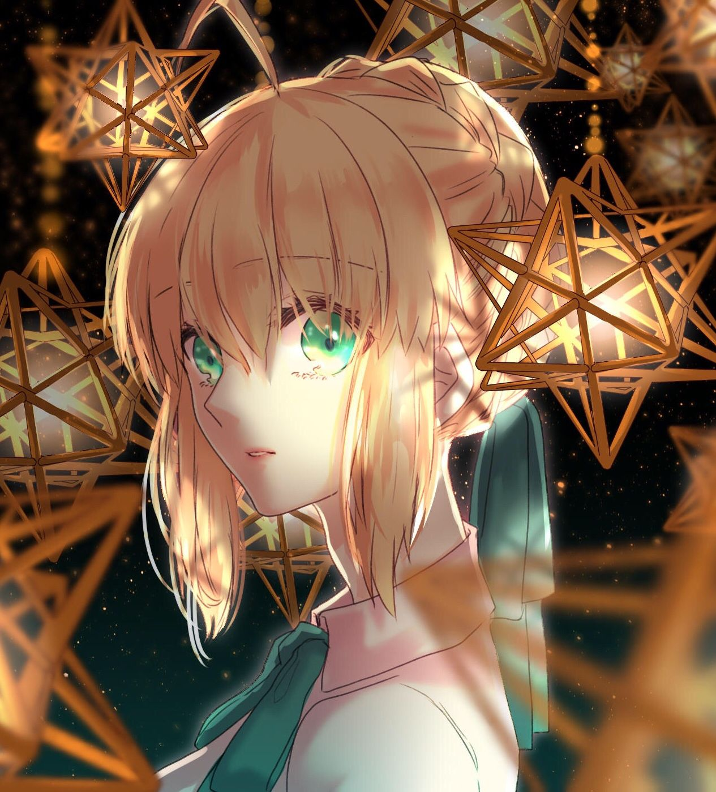

# Hi, I'm Nori 

*in this life you need something to take the edge off*

*Disclaimer: The artworks shown here are not mine. Credits to the original artists.*

---

### About Me

Software Engineering student at ALT University.
Developing **"Liam"** — a custom local **AI architecture** (working with pre-trained models).
Deeply into **Unreal Engine 5** (Blueprints) and hard-surface 3D modeling in **Blender**.
DIY enthusiast & Physics explorer — I love seeing how things work mechanically, but keep the formulas away from me.
Interested in firearm mechanics and dark fantasy stories.

---

### Tech Stack & Tools

---

**Vibecoder eheh**

